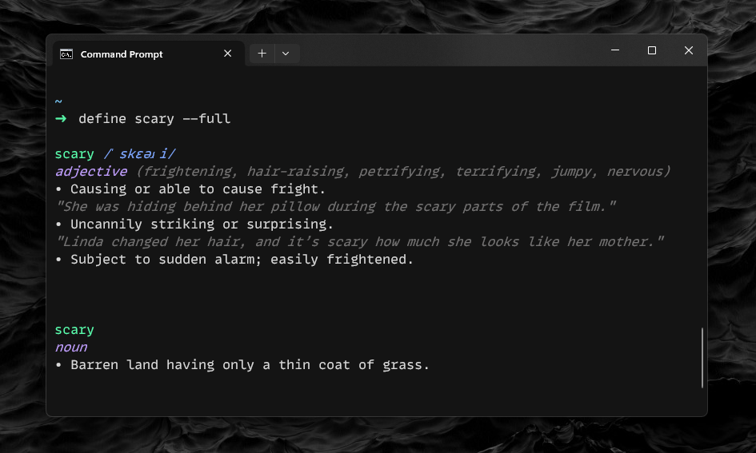

---

  <h3>🔠 Define</h3>
  
Define words right from your terminal.

---

## Usage

`define <word>`

### Flags

- `-s`, `--synonyms` Show synonyms for definitions.
- `-a`, `--antonyms` Show antonyms for definitions.
- `-e`, `--examples` Show examples for definitions.
- `-f`, `--full` Show synonyms, antonyms, and examples.

## Installation

### Binaries
Binaries can be found on [the releases page](/releases/latest).

### Installing through Cargo
`cargo install --git https://github.com/marioparaschiv/define`

## Licensing
See [LICENSE](/LICENSE).
